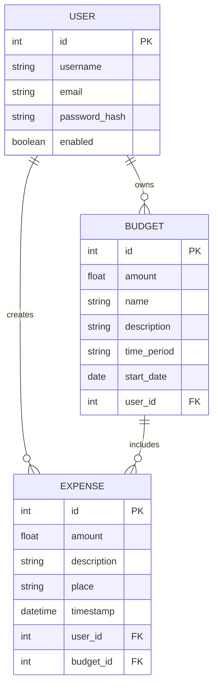

# Expense Tracker

A full-stack application for tracking personal expenses.  
**Spring Boot + PostgreSQL (Backend)** and **Angular + Nginx (Frontend)**.

---

## 🚀 Features
- User registration and authentication
- CRUD operations for categories and transactions
- Data persistence with PostgreSQL
- JWT authentication
- Deployment with Docker Compose

---

## 🛠️ Tech Stack
- **Backend**: Java 21, Spring Boot 3, Spring Data JPA, Spring Security
- **Database**: PostgreSQL
- **Frontend**: Angular, TypeScript, Nginx
- **Infrastructure**: Docker, Docker Compose, GitHub Actions CI/CD

---

## 📦 Running the Project

```bash
# build and start all containers
docker-compose --env-file .env.example up
```
## 🗂️ Database ER Diagram (MVP)




